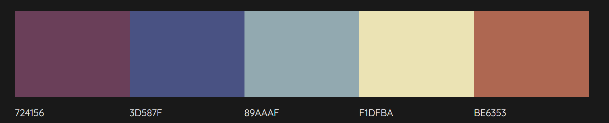
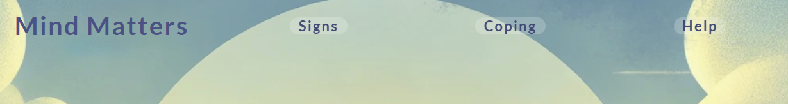
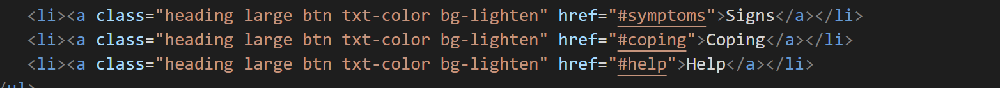
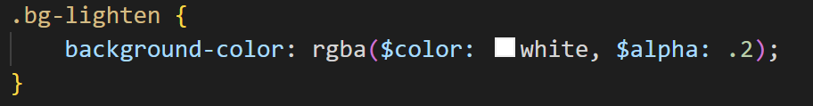
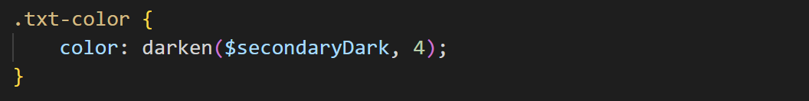
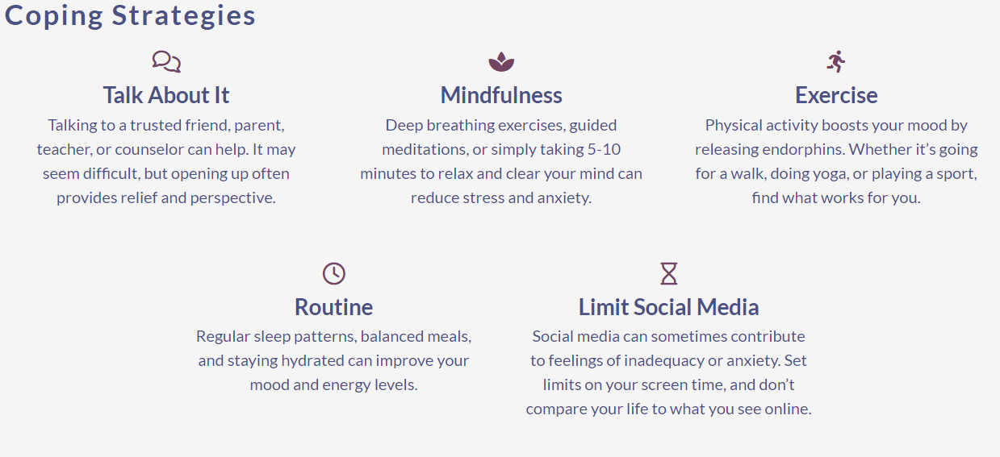
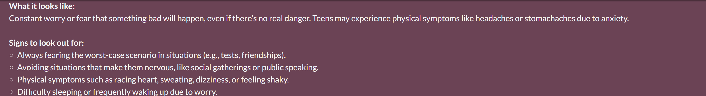

# Mental Health Awareness

## Overview

### Purpose
The purpose of this project is to provide basic information pertinent to mental health. It aims to raise awareness of both common mental health issues, the signs to look for, and some guidance on how to cope with and manage things like stress.

Users should find this an easy to navigate tool for learning the basic infomation quickly, and being a good source of coping strategies/techniques.

### Target Audience
The target audience will primarily be students, teenagers, and parents who are in need of information, guidance, and/or strategies for spotting and/or coping with mental health issues.

These users will gain the most value as they will be able to access the most relevant information quickly, and easily find information to help guide them as to what they could try next.

## User Stories

### Must-Have User Stories

**Member of General Public**:

- *Background:* A 30-year old individual seeking basic mental health information for personal understanding.
- *Feature Needed:* Easy-to-navigate sections, specifically wants to get around the site fast.
- *Success Criteria:*
  - Navigation menu linked to sections
  - Easy to read names

**Young Adult**:

- *Background:* A university student experiencing stress during their exam season.
- *Feature Needed:* Coping strategies section with practical tips for managing stress
- *Success Criteria:*
  - At least five visually appealing coping strategies with concise descriptions.
  - Visual aids (icons/images) complement the text.

**Parent**:

- *Background:* A parent is looking to understand mental health to support their children (teenagers).
- *Feature Needed:* Signs and symptoms section focused on youth mental health issues.
- *Success Criteria:*
  - Section includes a clear list of symptoms/signs to look out for.

### Should-Have User Stories

**Support Seeker**:

- *Background:* An individual who suspects they may have anxiety and wants to know where to get help.
- *Feature Needed:* Some simple pointers to sources of profesional help.
- *Acceptance Criteria:*
  - phone numbers for support lines, links to mental health groups, etc.

**Student**:

- *Background:* A student with more questions.
- *Feature Needed:* Links to mental health groups and an FAQ.
- *Acceptance Criteria:*
  - Have FAQs on the page.
  - links to mental health pages.

**Distracted Student**:

- *Background:* A student who is easily distracted unless getting a feedback response.
- *Feature Needed:* Buttons/links need to react to the user hovering over them, or clicking on them.
- *Acceptance Criteria:*
  - Add transitions to the buttons on the page to make them more stimulating.

### Could-Have User Stories

**Advocate**:

- *Background:* An advocate looking to raise awareness and reduce stigma.
- *Feature Needed:* Call-to-action section for community involvement.
- *Acceptance Criteria:*
  - Clear steps for community involvement are present.
  - Social media sharing options are integrated for campaigns.

**The Easily Distracted User**:

- *Background:* A user who is easily distracted seeking interactive/responsive content.
- *Feature Needed:* Interactive/responsive elements to keep attention while providing information.
- *Acceptance Criteria:*
  - User responsive elements be incorporated into site.

**The Visual Learner**:

- *Background:* A visual learner who prefers graphic content.
- *Feature Needed:* Infographics summarizing key mental health concepts.
- *Acceptance Criteria:*
  - Infographics are visually appealing and easy to understand.

## Design Decisions

To start this section I will breakdown (from the must-have user stories) the most important elements for the webpage. This will then be used as the basis for the design of the site, and can be built upon once the MVP (minimum viable product is finished).

- Clear headings and subheadings
- Category oriented Navigation menu
- Five coping strategies
  - with icons
- list of mental health awareness signs to watch for (focus on teens/students)

### Wireframes

Based on the breakdown above, a linear "narrative" structure would be best; lead each individual through the page from start to finish in a logical sequence. The begining will introduce the subject, then I can have a section about what to look for, followed by the coping strategies, and then I could have a section on where to get help. This would cater to most of the must-have user story elements and produce a MVP that can be improved further if there is time.

The site is structured in this way as it allows to most important information to appear at the top. That is to say, the logical way of providing this information is to give the coping strategies after the symptoms (as someone might see the symptoms, decide they haven't seen any, and then leave the page; such a person will not be interested in the strategies or resources). Thus the most important information is placed closest to the top.

My initial designs for the mobile (small devices) look like this...

The full page was visualised as this...

The list of symptoms to watch for may also be redesigned depending on the content, and the general aesthetic of the site. It is currently planned as...

Left side is initial plan, right is alternative:

Moving up in terms of the device size, the wireframe for the full page, on a tablet, is below on the left, and the full wireframe for a large device is on the right:

 

### Accessibility Considerations
There are a fair few considerations that have been made in terms of the accessibilty of the site. All images/icons will be given alt text so that screen readers can describe them. Additionaly, the contrast of the colours used will ensure that text can always be read easily and the font will also be selected based on its legibility.

#### fonts

I want the fonts to be modern, clean, and readable. For this reason I have decided upon two fonts:

Lato: [Link to Google fonts Lato page](https://fonts.google.com/specimen/Lato?query=lato)

The Lato font will be the primary font used on the website; it has a modern design, is easily readable, and is used a lot on the web. 
  - Headers: will be done in bold or semi-bold to make them stand out.
  - Body: will be regular, or even light depending on legibility.

Nunito: [Link to Google fonts Nunito page](https://fonts.google.com/specimen/Nunito?query=nunito)

The roundedness of Nunito makes it a slightly friendlier font to use on things that I want to differentiate and stand out some more.
  - It may be used in sub-headers or buttons as it's a bit more welcoming.

Font Sizes:
  - H1: 32-40px
  - H2: 28-32px
  - H3: 22-26px
  - Body Text: 16-18px

### colour/theme

The selected colours have been chosen with the subject matter of the website in mind; so chosen to evoke calmer responses, etc.

I will also endeavour to ensure that font-colours and their relevant background meet the accessibility standards for contrast.

This link will be used to check the colours meet the contrast ratios needed: [Colour Contrast Checker](https://webaim.org/resources/contrastchecker/)

The current colour pallete for the website was created with [Color Mind](http://colormind.io/bootstrap/)

## AI Tools Usage

### ChatGPT
ChatGPT will be used to generate all text content for the site. This will speed up the overall design process and allow me to focus more on the structure, wireframing, and building of the site.

The hero image used for the site was also generated by chatGPT.

The colour palette for the website was also revised after chatGPT created the hero image. The colours in the image seemed to fit the criteria better than the original palette. To get a palette out of the picture, I placed the image into [Color Mind](http://colormind.io/bootstrap/) and it created the following...

## Features

### Core Features (Must-Haves)

Feature 1: Navigation menu

I implemented the navigation menu at the top of the page. It is sticky, but only relevant to the header; it does not follow all the way down the page (which felt short enough to justify). I made the navigation bar float over the top of a background image, and to ensure a good contrast ratio I applied a background to each item that just lightend the colours behind the text.

The acceptance criteria of this feature was that it should be readable, and that each item should be linked to its relevant section. 
Each of the items possess an href link that targets the id of each relevant section so that the page will jump there when clicked.

Additionally, the buttons of the navigation bar have a high contrast facilitated by two things: 1. the transparent background that increases the lightness of the colours behind the button; and 2. the utilisation of the darken function applied to the colour variable used on the text.

Because of this, the nav items meet the criteria of being easy to read and linked to relevant sections.

Feature 2: five coping strategy cards, with descriptions, and visual aids (such as icons)

The coping strategies section was created using the css grid method. This was used as it is a better alternative to boostrap grid: more adaptable, and easier to implement without bloating html code. 
To create the required five items I essentially made five cards. Each one contains an icon, followed by a title, then the concise description.

By nature of the size each card was confined to the descriptions had to be concise. Each of the cards here meets the needs of a student looking for coping strategies that might help them to manage the stress. 
The success criteria were to have at least five items, with concise descriptions, and that each one have a relevant icon.

Feature 3: List of symptoms

The list of symptoms was implemented using some code from [W3schools](https://www.w3schools.com/howto/howto_js_accordion.asp), specifically their code for an accordion. 
It is broken down into five sections, each of which focuses on a slightly different mental health issue.

Each of the items, when clicked on, will open up their own drop-down where the information is provided in the following format:

Every item in the accordion posesses information  describing what the mental health issue can look like, and the signs to watch out for.

The success criteria of this user was to have a clear list of symptoms to look out for. In this case the accordion was made to fit that purpose, but it needed to diverge into multiple possible symptom lists as there can be an array of issues each of which are somewhat unique.

### Advanced Features (Should-Haves)

### Optional Features (Could-Haves)

## AI Tools Usage

## Testing and Validation

### Testing Results

### Validation

## Deployment

### Deployment Process

## AI Tools Usage

### Reflection

## Reflection on Development Process

### Successes

### Challenges

### Final Thoughts

## Code Attribution

### Accordion and Panels
The code for the accordion, including the JavaScript at the end of the body in index.html was found on the W3Schools site at this link: [Collapsibles/Accordion](https://www.w3schools.com/howto/howto_js_accordion.asp)

## Future Improvements

## References for Resources

### Josh Comeau's updated CSS Reset
This is a standard template that can be used at the beginning of any project. Its purpose is to override some of the standard styling applied to elements that usually are overriden in the course of a project anyway.

You can find a link to this and its explanations here: [Josh Comeau's CSS Reset](https://www.joshwcomeau.com/css/custom-css-reset/)

Perhaps the most important part is the box sizing part near the begining.

### CSS Pre-Compiler
SCSS (or SASS) was used to precompile the CSS. The pre-compiler allows CSS code to function more like a normal language; one can make use of variables, mathmatical functions, if statements, etc.

- [SASS website](https://sass-lang.com/)

- [link to repository used to determine required settings vscode live sass compiler](https://github.com/glenn2223/vscode-live-sass-compiler/tree/87b33f56d180a430779f97c523a559491335781f)

### Methodologies
Object Oriented Cascading Style Sheets (OOCSS)

- [Link to Video on subject](https://www.youtube.com/watch?v=hTZGfVRlqTI)