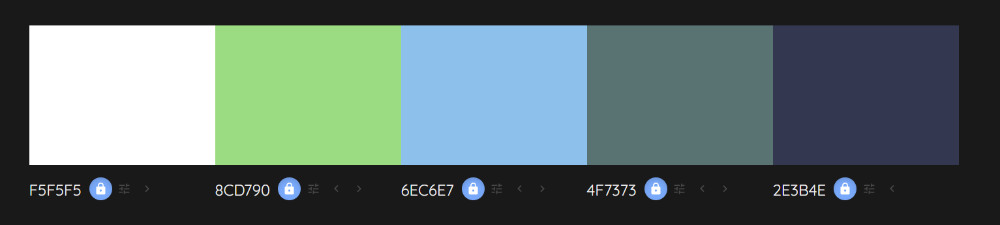

# Mental Health Awareness

## Overview

### Purpose
The purpose of this project is to provide basic information pertinent to mental health. It aims to raise awareness of both common mental health issues, the signs to look for, and some guidance on how to cope with and manage things like stress.

Users should find this an easy to navigate tool for learning the basic infomation quickly, and being a good source of coping strategies/techniques.

### Target Audience
The target audience will primarily be students, teenagers, and parents who are in need of information, guidance, and/or strategies for spotting and/or coping with mental health issues.

These users will gain the most value as they will be able to access the most relevant information quickly, and easily find information to help guide them as to what they could try next.

## User Stories

### Must-Have User Stories

**Member of General Public**:

- *Background:* A 30-year old individual seeking basic mental health information for personal understanding.
- *Feature Needed:* Easy-to-navigate sections with clear definitions of mental health terms.
- *Success Criteria:*
  - Clear headings and subheadings.
  - Navigation menu with Categories.

**Young Adult**:

- *Background:* A university student experiencing stress during their exam season.
- *Feature Needed:* Coping strategies section with practical tips for managing stress
- *Success Criteria:*
  - At least five visually appealing coping strategies with concise descriptions.
  - Visual aids (icons/images) complement the text.
  - tips could include links to resources for deeper understanding.

**Parent**:

- *Background:* A parent is looking to understand mental health to support their children (teenagers).
- *Feature Needed:* Signs and symptoms section focused on youth mental health issues.
- *Success Criteria:*
  - Section includes a clear list of signs specific to teenagers.
  - Visual aids (icons/images) accompany each symptom for clarity.

### Should-Have User Stories

**Support Seeker**:

- *Background:* An individual who suspects they may have anxiety and wants to know when to seek help.
- *Feature Needed:* A simple guide on when to seek profesional help.
- *Acceptance Criteria:*
  - Checklist or flowchart is prominently displayed for easy reference.
  - Contact information for mental health services is easily accessible.

**Educator**:

- *Background:* A teacher interested in promoting mental health awareness in the classroom.
- *Feature Needed:* Resources section with links to educational materials and workshops.
- *Acceptance Criteria:*
  - Curated list of resources includes downloadable materials.
  - Links to relevant organisations and upcoming events are updated regularly.

**Educational Body**:

- *Background:* A school whats to put together workshops to raise awareness for their students.
- *Feature Needed:* Links to support for individuals.
- *Acceptance Criteria:*
  - Section outlines practical steps for implementing initiatives.

### Could-Have User Stories

**Advocate**:

- *Background:* An advocate looking to raise awareness and reduce stigma.
- *Feature Needed:* Call-to-action section for community involvement.
- *Acceptance Criteria:*
  - Clear steps for community involvement are present.
  - Social media sharing options are integrated for campaigns.

**The Easily Distracted User**:

- *Background:* A user who is easily distracted seeking interactive/responsive content.
- *Feature Needed:* Interactive/responsive elements to keep attention while providing information.
- *Acceptance Criteria:*
  - User responsive elements be incorporated into site.

**The Visual Learner**:

- *Background:* A visual learner who prefers graphic content.
- *Feature Needed:* Infographics summarizing key mental health concepts.
- *Acceptance Criteria:*
  - Infographics are visually appealing and easy to understand.

## Design Decisions

To start this section I will breakdown (from the must-have user stories) the most important elements for the webpage. This will then be used as the basis for the design of the site, and can be built upon once the MVP (minimum viable product is finished).

- Clear headings and subheadings
- Category oriented Navigation menu
- Five coping strategies
  - with icons
- list of mental health awareness signs to watch for (focus on teens/students)

### Wireframes

Based on the breakdown above, a linear "narrative" structure would be best; lead each individual through the page from start to finish in a logical sequence. The begining will introduce the subject, then I can have a section about what to look for, followed by the coping strategies, and then I could have a section on where to get help. This would cater to most of the must-have user story elements and produce a MVP that can be improved further if there is time.

The site is structured in this way as it allows to most important information to appear at the top. That is to say, the logical way of providing this information is to give the coping strategies after the symptoms (as someone might see the symptoms, decide they haven't seen any, and then leave the page; such a person will not be interested in the strategies or resources). Thus the most important information is placed closest to the top.

My initial designs for the mobile (small devices) look like this...

The full page was visualised as this...

The list of symptoms to watch for may also be redesigned depending on the content, and the general aesthetic of the site. It is currently planned as...

Left side is initial plan, right is alternative:

### Accessibility Considerations
There are a fair few considerations that have been made in terms of the accessibilty of the site. All images/icons will be given alt text so that screen readers can describe them. Additionaly, the contrast of the colours used will ensure that text can always be read easily and the font will also be selected based on its legibility.

#### fonts

I want the fonts to be modern, clean, and readable. For this reason I have decided upon two fonts:

Lato: [Link to Google fonts Lato page](https://fonts.google.com/specimen/Lato?query=lato)

The Lato font will be the primary font used on the website; it has a modern design, is easily readable, and is used a lot on the web. 
  - Headers: will be done in bold or semi-bold to make them stand out.
  - Body: will be regular, or even light depending on legibility.

Nunito: [Link to Google fonts Nunito page](https://fonts.google.com/specimen/Nunito?query=nunito)

The roundedness of Nunito makes it a slightly friendlier font to use on things that I want to differentiate and stand out some more.
  - It may be used in sub-headers or buttons as it's a bit more welcoming.

Font Sizes:
  - H1: 32-40px
  - H2: 28-32px
  - H3: 22-26px
  - Body Text: 16-18px

### colour/theme

The selected colours have been chosen with the subject matter of the website in mind; so chosen to evoke calmer responses, etc.

I will also endeavour to ensure that font-colours and their relevant background meet the accessibility standards for contrast.

This link will be used to check the colours meet the contrast ratios needed: [Colour Contrast Checker](https://webaim.org/resources/contrastchecker/)

The current colour pallete for the website was created with [Color Mind](http://colormind.io/bootstrap/)

## AI Tools Usage

### DALL-E

### ChatGPT

## Features

### Core Features (Must-Haves)

### Advanced Features (Should-Haves)

### Optional Features (Could-Haves)

## AI Tools Usage

## Testing and Validation

### Testing Results

### Validation

## Deployment

### Deployment Process

## AI Tools Usage

### Reflection

## Reflection on Development Process

### Successes

### Challenges

### Final Thoughts

## Code Attribution

## Future Improvements

## References for Resources

### Josh Comeau's updated CSS Reset
This is a standard template that can be used at the beginning of any project. Its purpose is to override some of the standard styling applied to elements that usually are overriden in the course of a project anyway.

You can find a link to this and its explanations here: [Josh Comeau's CSS Reset](https://www.joshwcomeau.com/css/custom-css-reset/)

Perhaps the most important part is the box sizing part near the begining.

### CSS Pre-Compiler
SCSS (or SASS) was used to precompile the CSS. The pre-compiler allows CSS code to function more like a normal language; one can make use of variables, mathmatical functions, if statements, etc.

- [SASS website](https://sass-lang.com/)

- [link to repository used to determine required settings vscode live sass compiler](https://github.com/glenn2223/vscode-live-sass-compiler/tree/87b33f56d180a430779f97c523a559491335781f)

### Methodologies
Object Oriented Cascading Style Sheets (OOCSS)

- [Link to Video on subject](https://www.youtube.com/watch?v=hTZGfVRlqTI)